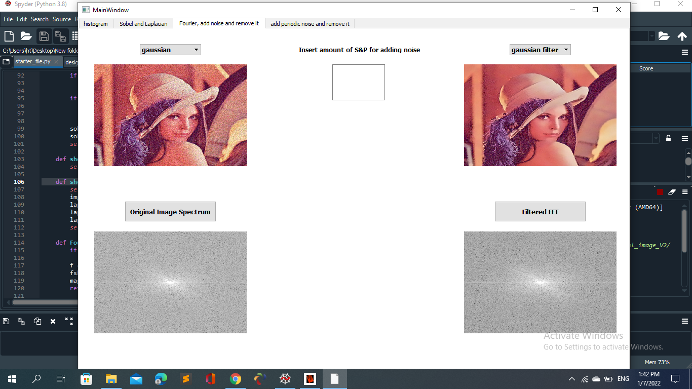
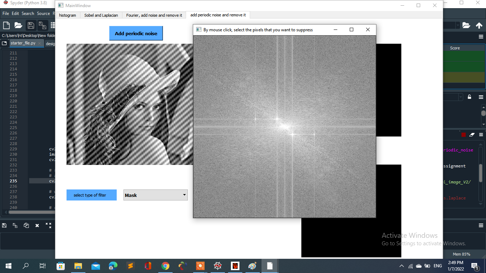
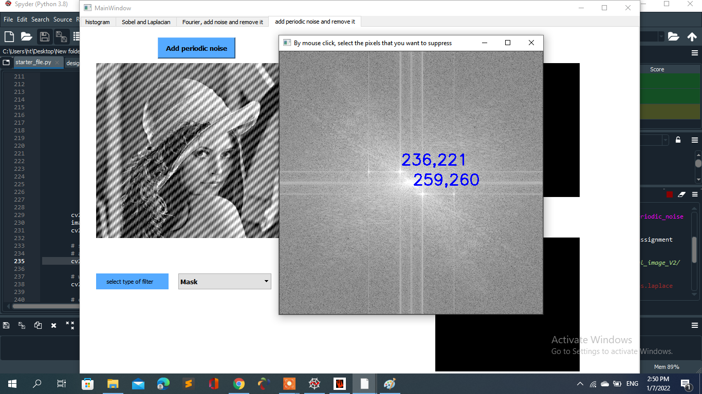
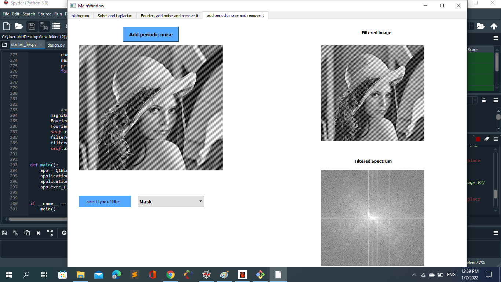

# project_final_image
## Watch our 
## How to work:
## 1. load the image
## 2. if the user press on calcuate histogram button:
## - in the backend of the gui, the image is converted to grayscale.
## - after that the histogram is calculated for it using opencv.
## - finally, the histogram will show for the user.
 

## 3. Eqalize the image:
## - if equalize button is pressed, the image is converted to YCrCb.
## - then equalize the hitogram of the Y channel
## - convert back to RGB color-space from YCrCb.
## - press calculate equalize histogram button, to show histogram of equalized image.

## 4. move to "sobel and laplacian" tab.
## 5. insert the kernal size that is used for sobel detection

## 6. press sobel button, the pop window will show for you, you can choose from the combo box the direction that you want to calculate sobel in it ( X or Y or XY).

## 7. if you change the kernal size to 3.

## 8. press the laplacian button, also the pop window will show for you with calculated laplace edge detection for the image.

## 9. move to "fourier, add noise and remove it" tab.

## 10. choose from the combo box which type from noise that you want to add and then once you choose the type, the noisy image will be displayed with its fourier for you.
## - gaussian noise:

## - choose gaussian filter from "remove noise combo box", the filtered image and its fourier will be displayed for you.

## - salt and paper noise: you should insert the amount of salt and paper that you want to be added.

## - choose median filter from "remove noise combo box", the filtered image and its fourier will be displayed for you.

## 11. move to "add periodic noise and remove it" tab.

## 12. press "add periodic noise button".

## 13. select type of filter that you want to remove periodic noise from the combo box.

## 14. if you choose band reject filter, the filtered image and its fourier will be displayed for you.

## 15. if you choose mask method for remove periodic noise, the pop window, contains the fourier of the periodic noise image, will be displayed for you.

## 16. then by mouse click, select the pixels that you want to suppress in fourier transform.

## 17. then press any key from keyboard, to out from this pop window.
## 18. after that, the filtered image and its fourier will be displayed for you.

